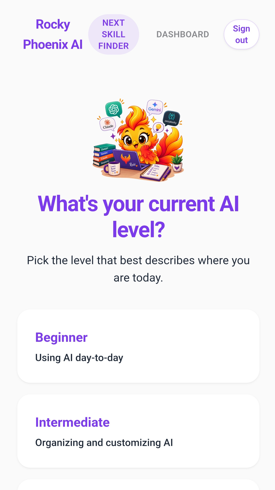
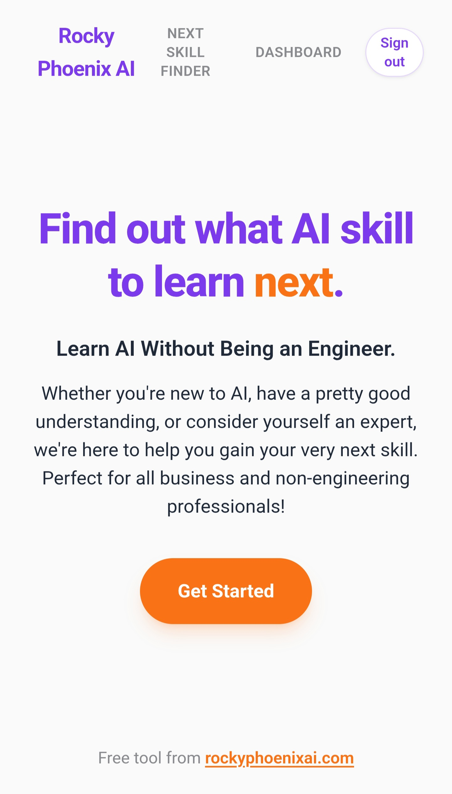
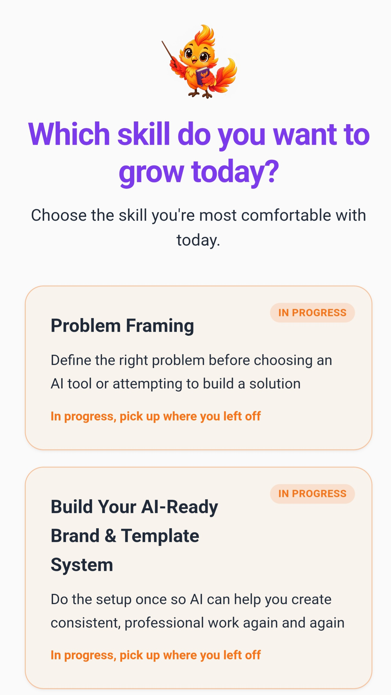

# Your Next Skill

**Find out what AI skill to learn next.**

Your Next Skill is a guided, self-paced AI learning and enablement platform from **Rocky Phoenix AI**, designed to help business and non-engineering professionals turn AI interest into practical skills they can use at work.

> **Status:** Public Beta

## See It in Action

▶️ **[Watch the product demo](your%20next%20skill.mp4)**

The demo walks through the experience so professionals and team leaders can understand the product without completing the full learning journey themselves.

### Find your starting point

Users choose the AI level that best describes where they are today, creating a clearer starting point for skill development.

### Identify what to learn next

Instead of presenting one large course catalog, the experience helps users focus on the skill that makes sense for them now.

### Learn through practical lessons

Lessons are designed around workplace application rather than AI theory alone. Foundational AI-literacy lessons remain available across learning levels.

### Continue where you left off

The platform tracks lesson state so learners can return to skills already in progress instead of starting over.

## Why I Built It

AI learning can quickly become a collection of disconnected tutorials, certificates, prompts, and tools. Knowing *what* to learn next — and how that skill applies to actual work — is often the harder problem.

Your Next Skill creates a more practical learning path. Users can assess their current skill level, explore structured lessons, and build toward increasingly applied AI capabilities.

## How It Works

1. **Assess your starting point** — Beginner, Intermediate, Advanced, or Applied & Leadership.
2. **Identify the next skill** instead of trying to learn everything at once.
3. **Learn through focused lessons** built around practical workplace use.
4. **Apply the skill** through exercises, projects, prompt packs, and capstones.
5. **Track progress** and continue building toward more advanced AI capabilities.

## Learning Paths

### AI Foundations — Lessons for Everyone

Core AI literacy topics designed to matter regardless of role or experience level include safe and responsible AI use, ethics and bias, privacy/security/data awareness, verification, and AI's environmental impact.

### Beginner

Build confidence using AI tools and organizing everyday AI work through connectors, projects, AI usage management, prompt packs, and a capstone.

### Intermediate

Move from using AI features to designing repeatable solutions through problem framing, custom GPTs, tool stacking, digital twins, documents/decks, and brand/template systems.

### Advanced

Build more sophisticated AI-enabled workflows and systems across automation, APIs, data, agents, workflow design, and testing/evaluation.

### Applied & Leadership

Move beyond individual AI usage into organizational adoption, strategy, workforce enablement, responsible implementation, and workflow transformation.

## What Makes Your Next Skill Different

This isn't designed around collecting more AI certificates. The focus is **skill progression and application**.

The platform connects AI literacy with the things professionals increasingly need to do at work: frame problems, choose tools, build workflows, evaluate AI output, automate tasks, communicate AI concepts, and help teams adopt AI responsibly.

## Product Principles

**Practical over theoretical.** Lessons should connect to work someone actually needs to do.

**AI literacy before automation.** Responsible use, privacy, verification, and judgment are foundational skills — not optional extras.

**Progressive skill building.** Users should be able to see how foundational AI usage develops into workflow design, automation, agents, and strategy.

**Built for non-engineers too.** AI transformation requires far more than technical implementation. Business, HR, operations, learning, recruiting, and other professionals need applied AI fluency as well.

## Built With

The current product has been developed using an AI-assisted product stack including Lovable, Claude, Make.com, Google Workspace, and rapid AI-assisted product design and prototyping.

## Current Beta

Your Next Skill is currently being tested with professionals and HR/business leaders. Beta feedback is being used to improve the learning experience, interactivity, navigation, and progression model before broader release.

This repository is the **public product showcase** for the project. It intentionally does not expose private application logic, credentials, protected content, user data, or production configuration.

## Project Goal

> How do we help people build the AI skills they actually need next — without requiring them to become AI engineers?

The goal is to make AI upskilling more understandable, practical, responsible, and connected to real work.

## About Rocky Phoenix AI

Your Next Skill was created by **Ashley Harvey**, AI Strategy and Enablement Advisor at **Rocky Phoenix AI**.

Rocky Phoenix AI helps professionals and organizations move from AI experimentation to practical adoption through hands-on AI training, enablement, workflow design, and custom AI solutions.

## More Project Documentation

- [Product Overview](docs/PRODUCT.md)
- [Learning Paths](docs/LEARNING-PATHS.md)
- [Roadmap](docs/ROADMAP.md)

---

**Your Next Skill** · A Rocky Phoenix AI project
