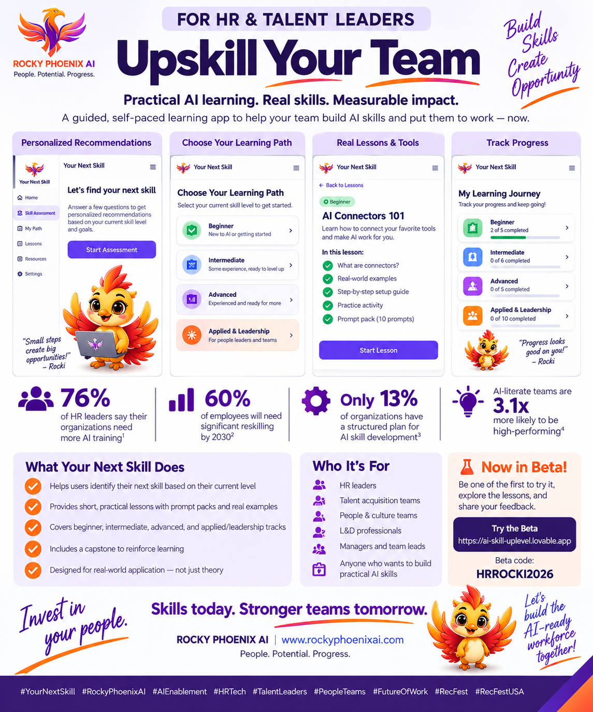
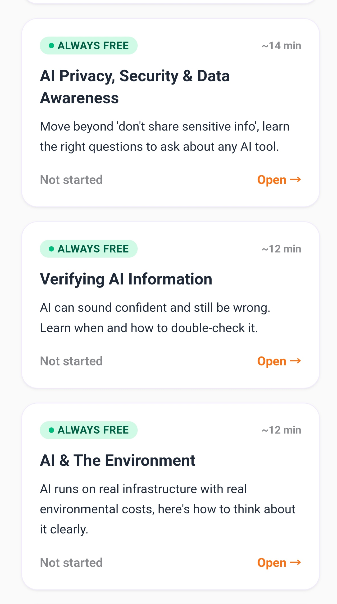

# Your Next Skill

**Find out what AI skill to learn next.**

Your Next Skill is a guided, self-paced AI learning platform from **Rocky Phoenix AI**, built to help professionals turn AI interest into practical skills they can use at work.

> **Status:** Public Beta

## See It in Action

▶️ **[Watch the product demo](assets/product-demo.mp4)**

Your Next Skill gives professionals a clear starting point, recommends practical learning paths, and helps them build skills progressively rather than trying to learn everything at once.

### Choose your starting point

Learners identify their current AI experience so they can focus on content appropriate to where they are now.

### Build practical AI skills

Learning includes foundational AI literacy such as safe AI use, responsible AI, ethics and bias, privacy and security, verification, and environmental awareness, alongside progressively more applied skills.

### Keep progressing

The experience helps learners return to lessons in progress and continue building toward more advanced AI capabilities.

## Learning Paths

**AI Foundations** · **Beginner** · **Intermediate** · **Advanced** · **Applied & Leadership**

Topics progress from responsible everyday AI use and prompting into problem framing, custom GPTs, tool stacking, automation, APIs, agents, workflow design, and organizational AI enablement.

## Why I Built It

AI learning can quickly become a collection of disconnected tutorials, certificates, prompts, and tools. The harder question is often: **What should I learn next, and how will I actually use it at work?**

Your Next Skill is designed around that question. The focus is not collecting more AI certificates — it's building practical capability step by step.

## Built With

Lovable · Claude · Make.com · Google Workspace · AI-assisted product design and rapid prototyping

## About

Your Next Skill was created by **Ashley Harvey, AI Strategy and Enablement Advisor at Rocky Phoenix AI**.

Rocky Phoenix AI helps professionals and organizations move from AI experimentation to practical adoption through hands-on AI training, enablement, workflow design, and custom AI solutions.

This repository is a public product showcase. Private application logic, credentials, protected learning content, user data, and production configuration are not included.

---

**Your Next Skill** · A Rocky Phoenix AI project
